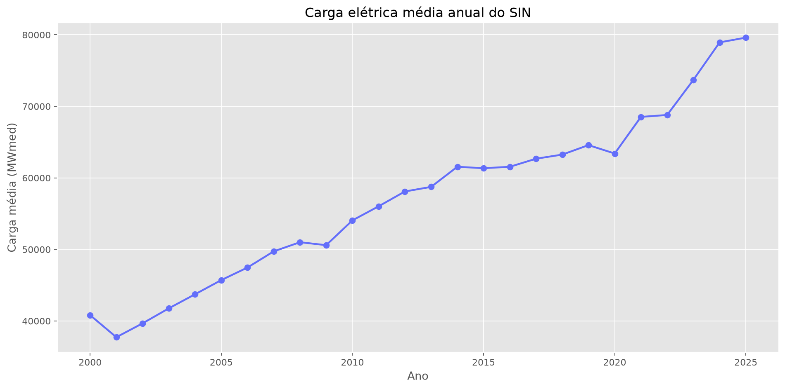
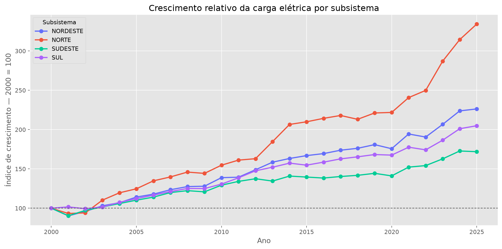
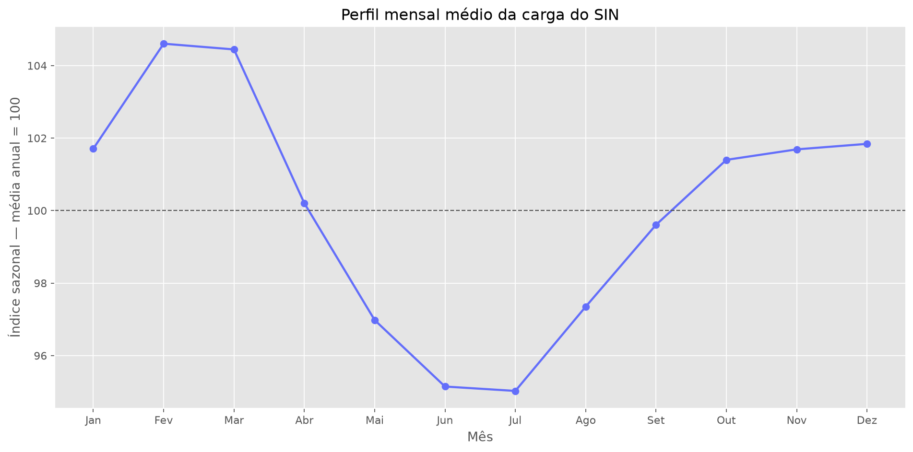
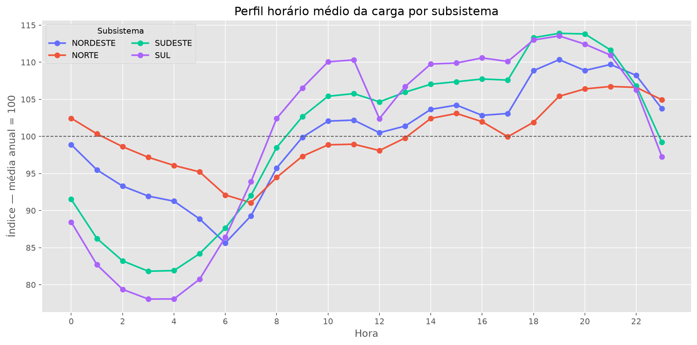
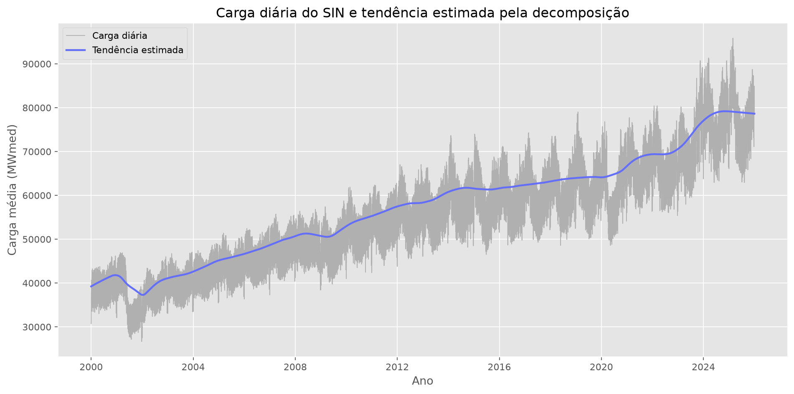
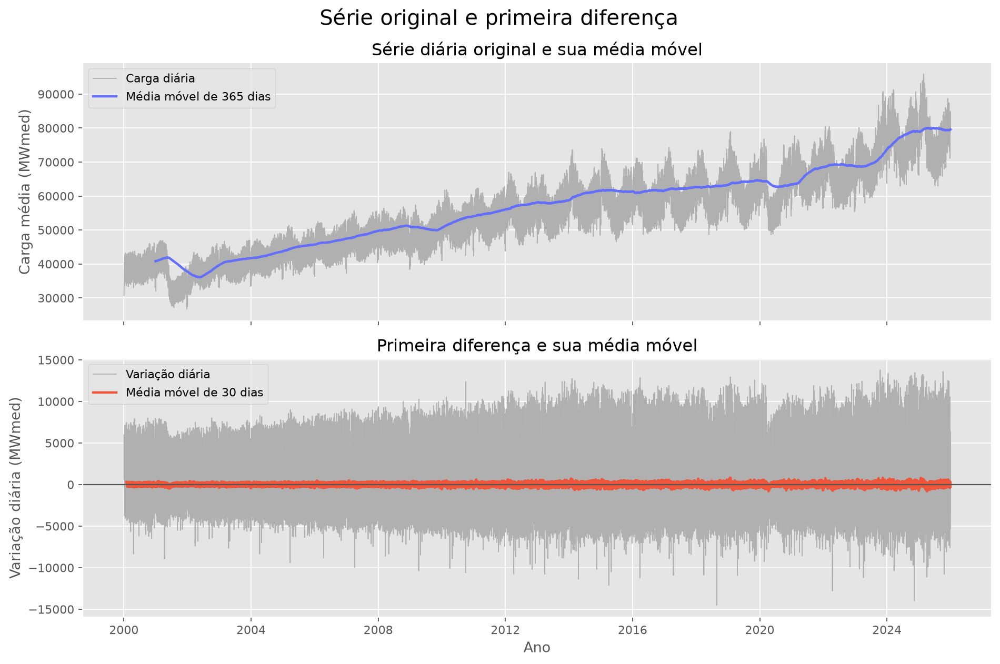

# Análise da Carga Elétrica no Brasil

Este projeto analisa o comportamento da carga elétrica dos subsistemas Norte, Nordeste, Sul e Sudeste entre 2000 e 2025.

A ideia é entender como a demanda por energia mudou ao longo dos anos, quais padrões aparecem dentro dos meses, semanas e horários e quais características precisam ser consideradas em uma série temporal desse tipo.

O projeto possui caráter descritivo e estatístico. Não foram utilizados modelos de Machine Learning nem técnicas de previsão.

## Fonte dos Dados

Os dados foram disponibilizados pelo [Operador Nacional do Sistema Elétrico — ONS](https://dados.ons.org.br/dataset/curva-carga), por meio do conjunto Curva de Carga Horária.

Cada linha representa a carga média registrada em um subsistema durante uma hora, medida em MWmed.

| Coluna | Descrição |
|---|---|
| id_subsistema | Sigla do subsistema elétrico |
| nom_subsistema | Nome do subsistema |
| din_instante | Data e hora de referência |
| val_cargaenergiahomwmed | Carga elétrica média no período, medida em MWmed |

O recorte utilizado possui:

- dados entre janeiro de 2000 e dezembro de 2025;
- frequência horária;
- quatro subsistemas: Norte, Nordeste, Sul e Sudeste;
- 911.608 registros após a consolidação dos arquivos anuais.

## Objetivo

O objetivo principal é compreender a evolução e os padrões da carga elétrica brasileira ao longo de 26 anos.

Durante a análise, foram investigadas as seguintes perguntas:

- Como a carga elétrica evoluiu ao longo dos anos?
- Quais subsistemas possuem as maiores cargas?
- Quais regiões apresentaram o maior crescimento proporcional?
- Existem padrões mensais, semanais e horários?
- O comportamento muda entre dias úteis e finais de semana?
- Como os subsistemas participam da carga total do SIN?
- A série diária possui tendência, sazonalidade e autocorrelação?
- A série pode ser considerada estacionária?

## Etapas do Projeto

O projeto começa com a coleta dos arquivos anuais e continua em quatro notebooks, executados em sequência.

| Arquivo | Etapa | Descrição |
|---|---|---|
| [collect.py](src/collect.py) | Coleta dos dados | Consulta o portal do ONS e baixa os arquivos anuais no formato Parquet. |
| [1.data_understanding.ipynb](notebooks/1.data_understanding.ipynb) | Entendimento dos dados | Analisa inicialmente o arquivo de 2025 para entender a estrutura, as colunas e os subsistemas disponíveis. |
| [2.data_consolidation.ipynb](notebooks/2.data_consolidation.ipynb) | Consolidação e qualidade | Reúne o histórico e verifica tipos, valores ausentes, duplicidades e continuidade temporal. |
| [3.exploratory_analysis.ipynb](notebooks/3.exploratory_analysis.ipynb) | Análise exploratória | Estuda a evolução histórica, a distribuição da carga e os padrões mensais, semanais e horários. |
| [4.time_series_diagnostics.ipynb](notebooks/4.time_series_diagnostics.ipynb) | Diagnóstico temporal | Analisa tendência, sazonalidade, autocorrelação, estacionariedade e resíduos da série diária. |

## Principais Resultados

### Evolução histórica

#### Carga média anual do SIN



**Insight:** A carga média anual do SIN passou de aproximadamente 40,8 mil MWmed em 2000 para 79,6 mil MWmed em 2025. Isso representa um crescimento de 95,06% no período e uma taxa média de 2,71% ao ano.

#### Crescimento por subsistema



**Insight:** O Norte apresentou o maior crescimento proporcional, com aumento de 234,21% em relação a 2000. Em seguida aparecem Nordeste, Sul e Sudeste, com crescimentos de 126,28%, 104,92% e 71,91%, respectivamente.

### Padrões temporais

#### Perfil mensal da carga do SIN



**Insight:** Fevereiro apresentou o maior índice mensal, com 104,60% da média anual, enquanto julho registrou o menor, com 95,03%. O resultado mostra uma redução da carga entre o começo do ano e o meio do ano, seguida por uma recuperação até dezembro.

#### Perfil horário dos subsistemas



**Insight:** Sul e Sudeste atingiram as menores cargas por volta das 3h e os maiores valores às 19h. No Nordeste, o pico também ocorreu às 19h, enquanto no Norte apareceu mais tarde, às 21h. Isso mostra que o comportamento horário não é igual entre os subsistemas.

### Diagnóstico da série temporal

#### Série diária e tendência



**Insight:** A tendência confirma o crescimento da carga do SIN ao longo dos 26 anos, mas também mostra períodos de desaceleração e queda. A partir de 2021, o avanço se torna mais acentuado e leva a série aos maiores níveis do período.

#### Série original e primeira diferença



**Insight:** A média da série original muda ao longo do tempo, indicando que ela não é estacionária. Depois da primeira diferença, as variações ficam distribuídas ao redor de zero. Os testes ADF e KPSS confirmaram a estacionariedade da série transformada, embora ainda existam valores extremos e mudanças na variabilidade.

## Tecnologias Utilizadas

- Python
- pandas
- NumPy
- Plotly
- Matplotlib
- Statsmodels
- PyArrow
- Requests
- JupyterLab

## Estrutura do Repositório

- data/raw: arquivos anuais coletados no formato Parquet;
- data/processed: dataset histórico consolidado;
- images: gráficos utilizados na apresentação dos principais resultados;
- notebooks: notebooks de entendimento, consolidação, análise exploratória e diagnóstico temporal;
- src/collect.py: script responsável pela coleta dos arquivos no portal do ONS;
- requirements.txt: dependências utilizadas no projeto.

As pastas de dados não são versionadas no GitHub. Os arquivos podem ser coletados novamente pelo script disponível em src.

## Como Executar o Projeto

### 1. Clonar o repositório

```bash
git clone https://github.com/nobertosousac/brazil-electric-load-analysis.git
cd brazil-electric-load-analysis
```

### 2. Criar e ativar o ambiente Conda

```bash
conda create -n energy_timeseries_env python=3.12 -y
conda activate energy_timeseries_env
```

Se o ambiente já existir, basta executar `conda activate energy_timeseries_env`.

### 3. Instalar as dependências

```bash
python -m pip install -r requirements.txt
```

### 4. Coletar os dados

Para baixar todo o período entre 2000 e 2025:

```bash
python src/collect.py
```

Também é possível escolher um intervalo:

```bash
python src/collect.py --start 2010 --stop 2025
```

Ou informar anos específicos:

```bash
python src/collect.py --years 2020 2021 2022
```

### 5. Abrir os notebooks

```bash
jupyter lab
```

Depois, execute os notebooks na ordem numérica. O segundo notebook cria o arquivo consolidado utilizado nas etapas seguintes.
